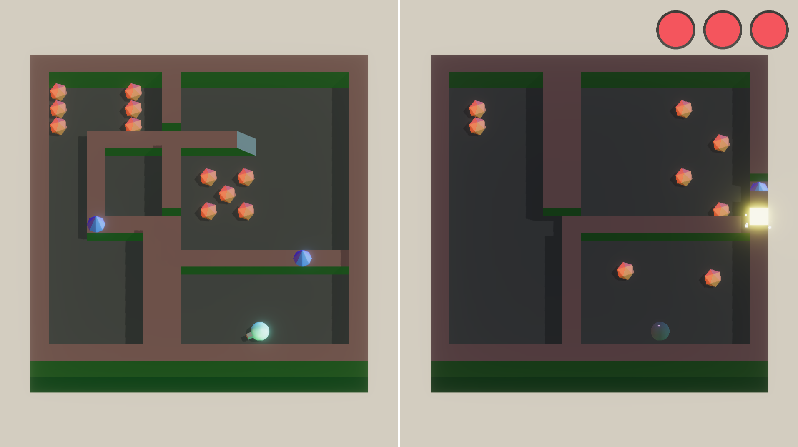

We launched our first commercial title today! It’s called *[Stereo Boy](https://stereoboygame.com)*.

You play a robot called Blit who’s crash-landed on an alien planet and trying to get home. There are puzzles. You can [grab it on Steam](https://store.steampowered.com/app/2073530/Stereo_Boy/) for eight bucks, even less if you catch the launch sale. Here’s a trailer:



<!--more-->

## Teleportation

Probably the first thing you notice about the game is that the screen is split in half. The two halves are parallel worlds. You can teleport from your current spot in one world to the same relative location in the other, as long as there’s a safe place to land. That means no pits or walls.



This is a tidy mechanic for making mazes! You can put bridges and ramps on the left side to access hard-to-reach spots on the right side. Throw in some technobabble about quantum mechanics, and bam! You’ve got yourself an intriguing and reasonably-priced piece of electronic entertainment.



## "Let's avoid making a puzzle game..."

*Stereo Boy* was our attempt to productionize the magnificently unpronounceable [*rePlace*](https://maingauchegames.itch.io/replace), a browser game we made for Global Game Jam 2022.

If you play *rePlace* (try it, it’s fun!), you’ll see that a lot of the core mechanics were right there from the beginning. The discerning fan may even notice some suspiciously familiar visual effects and sounds.

*rePlace*, however, was supposed to be a twin-stick shooter. Check out the pew-pew gun sounds and the pulse-pounding soundtrack! We thought, “hey, we’d be terrible a making a puzzle game.”

So we turned it into a puzzle game. In the intervening six months, the following occurred:

## No more twin-stick



We ripped out the twin-stick shooting; *Stereo Boy*’s shooting is way more deliberate and slow-paced. We even thought about getting rid of combat entirely. We were worried that people would think the combat was weird next to the puzzles. I might even agree with that a little bit, but we just decided to allow ourselves to be weird.

## Block-pushing for days



We added pushable blocks, one of the most insidious things you can introduce to a development cycle. It is truly the [ice-nine](https://en.wikipedia.org/wiki/Cat%27s_Cradle) of game design. Pretty soon our game about teleporting and shooting became a game about pushable blocks.

You want teleporting? Add teleporting to the pushable blocks. You still want shooting? *Really??* Make it so you can shoot the pushable blocks.

## (Programmer) Art



We learned enough Blender (and bought enough commodity 3D models) to make neat-looking environments.

## Orbit cam



We added a player-controlled orbit cam. With said neat-looking environments, we realized that *rePlace*'s rigidly locked camera wasn’t providing the most flattering look.

Of course, this ended up being an extremely consequential decision that caused a huge number of gameplay issues, some of which we’re not sure have been solved very well.

## Narrative



We somehow convinced ourselves to write a minor space opera, all for a game that was originally about a sphere shooting a bunch of cones.

## Tactical amputation



We cut Blit’s legs off. Walk cycles are hard!

---

Last but certainly not least, we managed to find a name that does not put capital letters in the middle of words.

One thing we *didn’t* do in the last six months was talk about the game very much. We’re doing this whole indie marketing thing backward. Conventional wisdom is to publish your devlog *while* you’re making your game, but we waited all the way until launch day to publish our first post.

But fear not! We’ve got plans for more in-depth posts about the development process. If nothing else, we have a bunch of hilarious mid-development screenshots to share. Follow us on the socials for more:

- [Discord](https://maingauche.games/discord)
- [Twitter](https://twitter.com/maingauchegames)
- [Facebook](https://www.facebook.com/maingauchegames)
- [Instagram](https://www.instagram.com/maingauchegames/)
- [Twitch](https://www.twitch.tv/maingauchegames)
- [TikTok](https://www.tiktok.com/@maingauchegames) (we’re still figuring it out)
