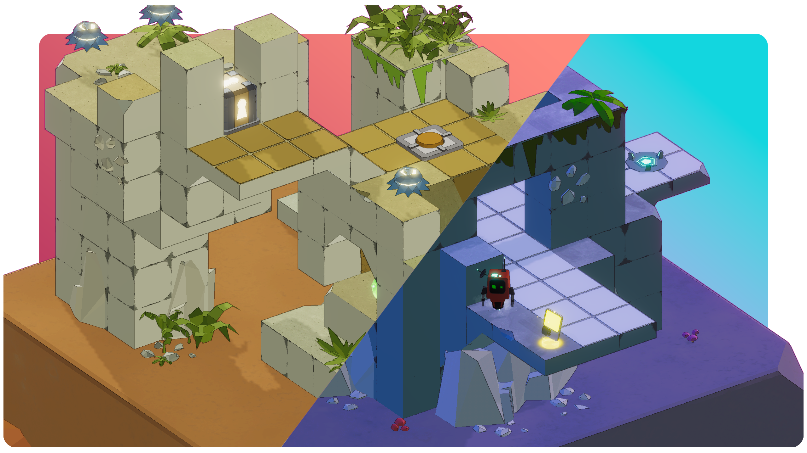
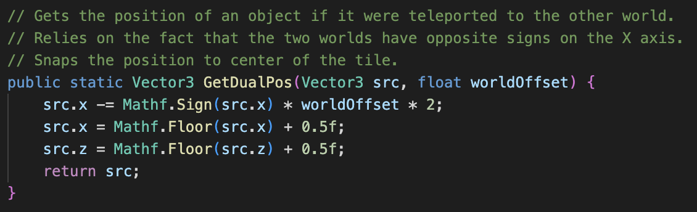
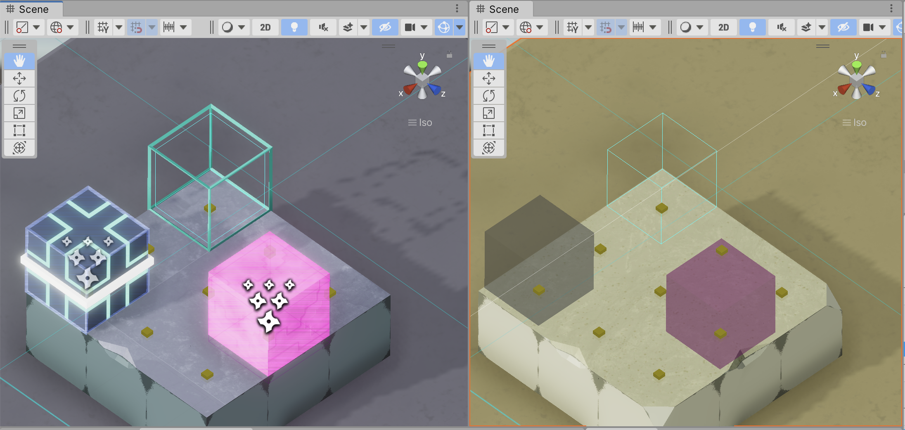
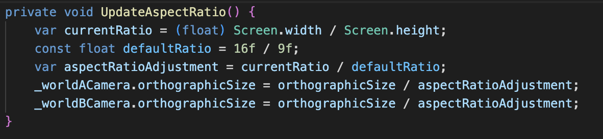
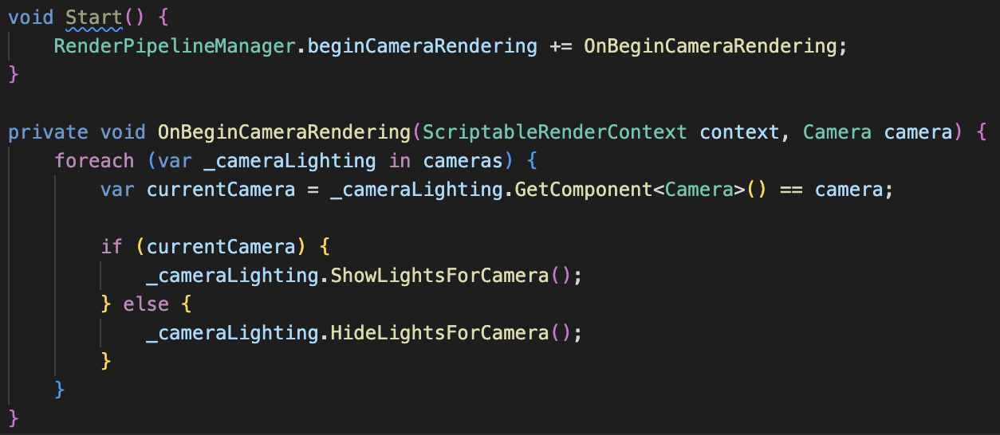

Dominic here!

The marquee feature of Stereo Boy is the ability to teleport between two worlds on each side of the screen. But how do we do it? I want to give a quick breakdown of our technical set up, from level design to camera setup to gameplay effects.

## Building a Dual-Level

When creating levels for Blit to explore, we considered a lot of different ways for the opposing worlds to interact in a scene. Load two scenes on separate layers? Build overlapping environments and toggle them on and off while editing and at runtime? Our ultimate answer was also the simplest: we just built the worlds very very far apart in a scene! We had access to this distance at all time in our camera controller via the variable `worldhalfOffsetX` which was calculated at runtime depending on the specific level dimensions (we used 9x9, 13x13 and 15x15 grids throughout the different areas of Stereo Boy).

This setup, while simple, still presented some challenges of its own: we couldn't see half of the entire level while we worked! And it was hard to design puzzles that didn't accidentally add breaks or skips to other puzzles as we went. 

### SceneView Camera Syncing

For the first problem, we settled on a Unity editor layout that used two Scene views in a layout very similar to our actual game display. In an editor script, we added a special callback to the `SceneView` object's `duringSceneGui` listener. We used this callback to sync the camera position and orientation of the two views as we edited. The short version of the algorithm is as follows:

* Check if there are exactly two SceneViews, and that we're operating on the inactive one (`SceneView.lastActiveSceneView` provides a quick check for this!)
* Grab the active scene view's offset from it's game world origin
* Apply the active view's camera orientation and offset to the inactive view

Here's a quick look at our editor camera syncing in action!



And here's a snippet of the code we used to make it work:

### Teleport (and other) indicators

The second issue when creating a level with two worlds is that we quickly found that we needed to be able to visualize what areas were available for the player and other objects to teleport into. It was really easy to accidentally create paths in one world that would accidentally offer a shortcut past an existing puzzle in the other. 

To combat this, we created our teleport visualizer dev tool! It first relies on getting the “dual position” of any given game object. To us, "dual position" meant the corresponding coordinates in the other world, mirroring across X axis:

Then, we query our 3D block map (more on that in a future post!) for an object at the dual position that allows teleporting on top of it – we just called these “flat” objects for simplicity – and that the object directly above that dual cell in our map doesn’t prevent teleporting. 

With that knowledge in hand, we can draw a widget in our scene view in both worlds that lets us quickly and easily visualize where a player can teleport. Check it out in this example where I paint in teleportable tiles on the right side, and then put an obstruction on the left. The yellow dot that is our teleport indicator instantly updates to make it easy to visual paths through the level. 



This extended to other objects that had a presence in both worlds. Dual blocks (pink) and teleport followers (black and blue) rendered an editor widget live at their opposite dual position to make it easy to tell where objects were going to be if their teleport was triggered. We also added an invisible "dual marker" block that is only visible in editor for us to place alignment points wherever needed. Here, it is the blue wireframe cube visible on both sides of the screen.

## Two Cameras, Same Window

Once we have our two worlds set up, to display them side-by-side we used two cameras: one displaying world "A" and one displaying world "B". The limits of our creativity for naming game objects knows no bounds! 

World A's camera is set to render on the left side of the screen by adjusting it's viewport rect to have a width of `0.5`. World B's camera is set to the exact same dimensions, but offset on the X axis by `0.5` units, thus filling our screen. Here's a clip of our cameras being disabled side-by-side to really make the effect clear:
 


Additionally, we need to handle a wide variety of aspect ratios in this split screen view. We use 16:9 as our default aspect ratio, and then adjust the camera's orthographic size too match whatever size is thrown at us, supporting everything from a 21:9 ultrawide monitor to an iPad's 4:3 TV-like screen. This quick adjustment makes sure our level boundaries are visible no matter the screen size:

## Communicating the Current World

Lastly, we wanted to make sure there was a clear transition from one world to the other when the player teleports. Just as each world half has its own camera, each one also has its own lighting and a global volume. To avoid collisions, we enable and disable each camera's lights conditionally in using [URP's beginCameraRendering](https://docs.unity3d.com/ScriptReference/Rendering.RenderPipelineManager-beginCameraRendering.html) delegate:

 Using [Feel from MoreMountains](https://feel.moremountains.com), we animate each camera's lights and global volume properties when the player triggers a teleport transition from one world to the other. The main light in each scene animates to give the shadows that quick look of elongating or shortening as the player moves with them, and the global volume turns down the saturation for the inactive world while popping in with a CRT-like effect on the active world. All put together, it looks like this:



Subtle, but it helps draw the eye to the correct side of the screen as the player switches back and forth.

---

Thanks for reading! We'd love to hear any questions you have about our setup, or go deeper on any particular chunk of code that's interesting - feel free to reach out on [Twitter](http://maingauche.games/stereoboy/twitter), [Discord](http://maingauche.games/stereoboy/discord) or [email](mailto:info@maingauche.games)! We're excited to share more about our block-based level editing tools in an upcoming devlog.