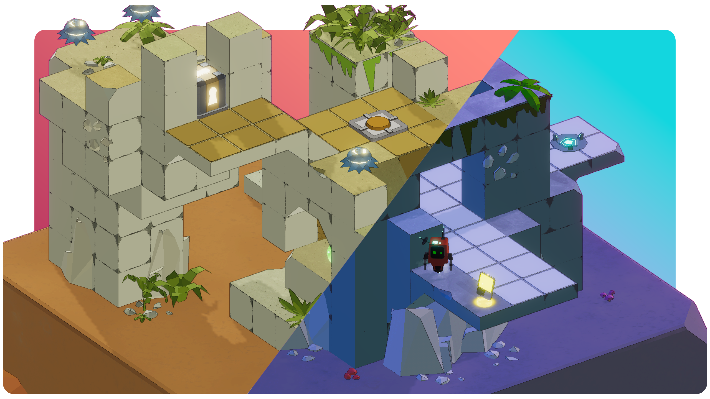
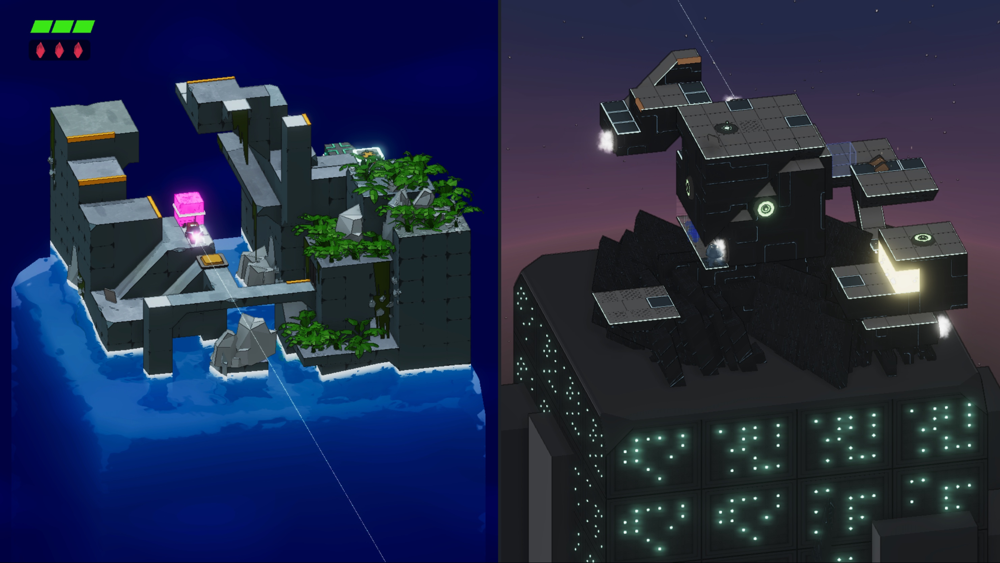
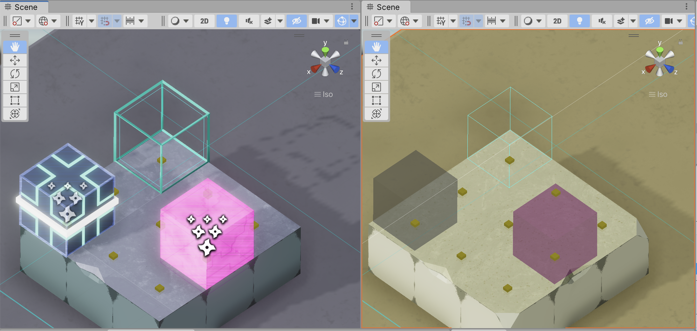

Stereo Boy's core mechanic is the ability to teleport between two worlds on either side of the screen. This post is a breakdown of how we implemented this unusual feature, across our tools, runtime cameras, and gameplay effects. We took advantage of the flexibility of [Unity's](https://unity.com/) editor and camera systems to meet our highly-specific needs.

## A quick look at the gameplay

Stereo Boy has an unusual camera setup for a single-player game.



There are two viewports, each containing different terrain. The player can jump from one viewport to the other as long as there's a safe landing spot at the same relative position on the other side.

## Representing two worlds in one scene

We considered a few different strategies for representing the opposing worlds. Load two scenes on separate Unity layers? Build overlapping environments and toggle them on and off at runtime?

The solution we settled on was not very glamorous, but it's easy to work with. We put both worlds into the same scene and separate them by a large distance along the X axis. Objects in the left world have a negative value for their X position, and objects in the right world have a positive value.



The illusion wasn't always airtight, and we had to chase down a fair number of related bugs. Ranged enemies could target the player across the divide, and some objects, such as the player's laser sight, were visible on both sides.


## Building a dual level

Designing levels with two separate worlds had some challenges. With the default Unity editor configuration, we couldn't see half of the entire level. And it was hard to add puzzles and routes that didn't accidentally break other puzzles that were already in the level.

### SceneView camera syncing

To do level design, we use a Unity editor layout that used two scene views, arranged in a way that resembled gameplay. For this to be truly useful, we need the editor cameras to move and rotate in sync, similar to the game cameras.



We created an editor script that installs a callback on the [`SceneView.duringSceneGui`](https://docs.unity3d.com/ScriptReference/SceneView-duringSceneGui.html) event. This callback updates camera positions and orientations in real time. The short version of the algorithm is as follows:

* Check if there are exactly two `SceneView`s, and that we're operating on the active one. `SceneView.lastActiveSceneView` provides a quick check for this.
* Grab the active scene view's offset from the world origin.
* Apply the active view's camera orientation and offset to the inactive view.

Here's a snippet of the code that makes it work:

```c#
public static void SyncCameras(SceneView updatingView) {
    if (updatingView != SceneView.lastActiveSceneView) {
        return;
    }

    if (SceneView.sceneViews.Count != 2) {
        return;
    }

    var sceneNeg = (SceneView) SceneView.sceneViews[0];
    var scenePos = (SceneView) SceneView.sceneViews[1];
    if (sceneNeg.position.x > scenePos.position.x) {
        (sceneNeg, scenePos) = (scenePos, sceneNeg);
    }

    if (SceneView.lastActiveSceneView != scenePos &&
        SceneView.lastActiveSceneView != sceneNeg) {
        return;
    }

    var (active, activeOrigin) = (scenePos, new Vector3(cc.worldhalfOffsetX, 0, 0));
    var (other, otherOrigin) = (sceneNeg, -activeOrigin);
    if (SceneView.lastActiveSceneView == sceneNeg) {
        (active, other) = (other, active);
        (activeOrigin, otherOrigin) = (otherOrigin, activeOrigin);
    }

    // There is always some lag between the user repositioning a scene
    // camera and this component's Update() call, so directly modifying the
    // camera's settings can be a little jerky. LookAt() provides some
    // springy/eased transitions that make it a bit less jarring.
    other.LookAt(
        otherOrigin + (active.pivot - activeOrigin),
        active.rotation,
        active.size,
        active.orthographic
    );
}
```

### Gizmos for teleportation paths

We discovered pretty early that designing levels would be difficult unless we had a visualizer that identifies which surfaces are safe for teleportation. The visualizer helps us plan routes for the player to access the other side. It's also essential for preventing *unintentional* paths that lead to shortcuts and other sequence breaks.

To implement the visualizer, we took the gameplay code that determines whether the player can safely teleport and wired it to an `OnDrawGizmos()` callback in an editor script. Areas where objects can teleport get marked with a small yellow dot. We tried to make the dots distinct enough to see at a glance, but not so large as to be distracting.

In the below example, I paint some teleport-safe tiles on the right side, and then put an obstruction on the left. The yellow dots update immediately, making it easy to visualize paths through the level. 



We took the idea of drawing things in both scene views one step further and added it to individual objects that had a presence in both worlds. Dual blocks (pink) and following blocks (black and blue) can teleport under certain gameplay scenarios. The editor renders these special blocks with a gizmo at their dual position. The gizmos make it easy to tell where objects are would land if they teleported.

We also added editor-only "dual marker" blocks that highlight key positions in the level. These are rendered as the blue wireframe cubes visible on both sides of the screen.



## Two cameras, one viewport

During gameplay, each level is rendered through two cameras. Unity's `Camera` class actually makes this straightforward!

The viewport rect of the left world's camera is configured with a width of `0.5`, causing it to fill only the left half of the screen. The right world's camera is set to the exact same dimensions but is offset on the viewport X axis by `0.5` units.

Here's a clip of our cameras being disabled side-by-side to really make the effect clear:
 


Additionally, we wanted to make sure that our level content would fit nicely into the viewport, regardless of aspect ratio. We use 16:9 as our default aspect ratio, and manually adjust the orthographic size (i.e. zoom) that is suitable for each level. A runtime script then adjusts each camera's orthographic size to match the current aspect ratio.

This allows us to support 21:9 UltraWide displays, as well as the 4:3 TV-like screen of an iPad. This quick adjustment makes sure our level boundaries are visible no matter the screen size:

```csharp
private void UpdateAspectRatio() {
    var currentRatio = (float) Screen.width / Screen.height;
    const float defaultRatio = 16f / 9f;
    var aspectRatioAdjustment = currentRatio / defaultRatio;
    _worldACamera.orthographicSize = orthographicSize / aspectRatioAdjustment;
    _worldBCamera.orthographicSize = orthographicSize / aspectRatioAdjustment;
}
```

## Where is the player right now?

Lastly, we wanted to make sure there was a clear transition from one world to the other when the player teleports.



Subtle, but it helps draw the eye to the correct side of the screen as the player switches back and forth.

Each world not only has its own camera but also its own global volume and set of lights. To avoid collisions, we enable and disable each camera's lights using URP's [beginCameraRendering](https://docs.unity3d.com/ScriptReference/Rendering.RenderPipelineManager-beginCameraRendering.html) delegate:

```csharp
void Start() {
    RenderPipelineManager.beginCameraRendering += OnBeginCameraRendering;
}

private void OnBeginCameraRendering(ScriptableRenderContext context, Camera camera) {
    foreach (var _camera in cameras) {
        var currentCamera = _camera.GetComponent<Camera>() == camera;

        if (currentCamera) {
            _camera.ShowLightsForCamera();
        } else {
            _camera.HideLightsForCamera();
        }
    }
}
```

 We animate each camera's lights and global volume properties when the player triggers a teleport transition from one world to the other. (We like [MoreMountains Feel](https://feel.moremountains.com) for doing simple property animation.)
 
 The full effect is the result of several smaller changes. The main light moves and rotates, causing shadows to elongate or shorten as the player moves. We dial down global volume saturation in the inactive world. To top it off, we play a CRT-like post-processing effect on the active world.

---

Thanks for reading! We'd love to hear any questions you have about our setup, or go deeper on any particular chunk of code that's interesting. Feel free to reach out on [Twitter](http://maingauche.games/stereoboy/twitter), [Discord](http://maingauche.games/stereoboy/discord), or [email](mailto:info@maingauche.games)! We're excited to share more about our block-based level editing tools in an upcoming post.