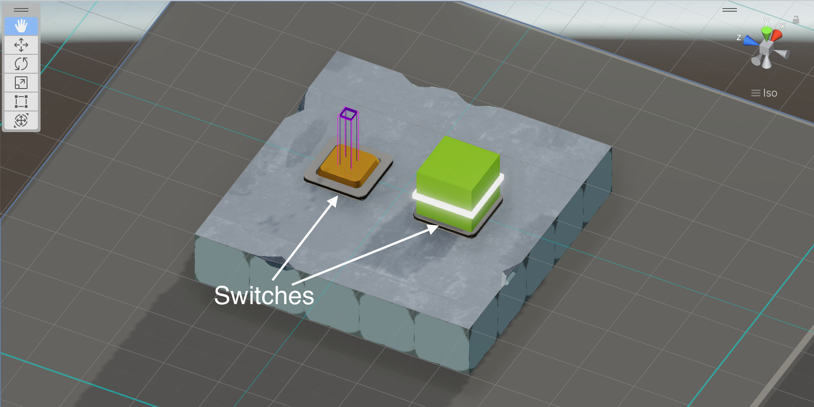

There are lots of good tilemap editors you can use for 2D games, but it's a different story for 3D.

For [Stereo Boy](https://stereoboygame.com), a game filled with grid-aligned cubes, we ended up writing a custom tool for 3D tile editing called Block Editor. Let's take a look at how it works.

<!--more-->

## Summary of features

### Building objects



You pick objects from a 3D-rendered selection palette, and create instances of them by clicking in the scene view. Objects are automatically aligned to a 3D grid. The tool guarantees that you can't place overlapping objects in the same grid cell.

Block Editor doesn't just do terrain. We use it for almost every positionable gameplay object, e.g. enemies, collectibles, player spawn points, and nav nodes.

### Deleting objects



You can also delete objects by switching to the deletion tool with the `D` key, and then clicking on objects in the scene view.

### Elevation



The build and delete tools operate at a specific elevation. You can move the elevation up and down with `Shift+W` and `Shift+S`.

Visualizing elevation can be a little tricky, so we added a few quality-of-life features to make things easier. We render an off-white wire grid at the current elevation. Also, selecting a new object will update the tool's elevation setting to match the selection.



### Rotation



Some objects, such as ramps, can be rotated before placement. You can toggle through rotations on the XZ plane in 90-degree increments using `Shift-A` and `Shift-D`.

### Skins



Sometimes you want the same logical object, but with different cosmetics. We refer to this concept as "skinning".

Five skins appear in Stereo Boy: sand, ice, stone, tech-dark, and tech-light. Each skin has its own set of basic shapes: walls, ramps, half-walls, etc. Under the hood, we made one prefab per skin per shape.

There's also a reskin tool, which updates the skin for previously-existing objects.



### Variants

On top of skins, we added a *second* layer of variation, which we referred to as "variants".



Variants were intended to be a generic way to add visual heterogeneity to the scene. But in the end, we only used them for two specific cases: adding visual hints for paths ("highlight walkable"), and calling out surfaces we didn't expect players to walk on ("highlight nonwalkable").

Under the hood, variants are expressed as an array of prefabs for the same shape and skin. If you're counting, that's *three* nested layers of prefabs: shapes, skins, and variants.

### Decorations



Most of the visual flair in Stereo Boy comes from decorations attached to pre-existing objects in the scene. We did this so much that we built it into Block Editor.

Decorations can be attached either to the top or side of an object. They are instantiated as child objects, so if a parent object gets moved, the decorations come along with it.

We thought it might be weird to have green trees in an ice level, so we made the decoration prefabs vary based on the skin of the parent object.



### Hero props



We referred to large-scale decorations as "hero props". These tend to require a lot of fiddly adjustment, so we didn't bother adding them to the tool. Instead, we add them the old-fashioned way, by dragging them into the scene.

### Bulk actions within a volume



We made a special tool called "Selector" that performs common actions on all objects within a rectangular volume. After specifying the position and dimensions of a volume, you can fill it with instances of the same object, delete all objects within the boundary, or select all objects within the boundary.

## Implementation notes

Block Editor has grown into a pretty big tool, but none of it is particularly clever. That said, some parts were a little tricky to implement, and are worth a deeper dive here.

### 3D selection palette

The most visually distinct part of Block Editor is the 3D selection palette. We use this widget to let the user pick the current object, skin, or decoration.



We implemented this using `PreviewRenderUtility`, which is available via the editor API, but unfortunately isn't documented[^1]. This was the only thing I could find that can render 3D viewports in Unity GUI windows.

`PreviewRenderUtility` is quite limited (e.g. it doesn’t render gizmos[^2]) but it’s simple to use. For the most part, it acts like a regular Unity scene. You position a camera, spawn some prefab instances, and then tell it when to render itself. Objects in the preview scene aren't commingled with objects in the regular scene, which is nice.

Block Editor's selection palette arranges the selectable objects in rows and columns on the XZ plane. There isn't a good way to draw primitives or gizmos in the preview scene, so we used prefabs to render the wire grid and hover/selection indicators.

Handling clicks is straightforward. Since the preview scene's camera is a full-fledged Unity camera, you can translate the window-relative mouse position into raycasts into the preview scene.

For an example of how to wire everything up, [check out the code](https://gist.github.com/jeffomatic/07f94b5626fb6e918cf715392d98cfc3) we used in Block Editor.

### Rendering previews over the mouse cursor

When the build tool is selected, Block Editor replaces the mouse cursor with a preview of the selected object. This serves as a good reminder of the current selection, and a reminder that the build tool is active in the first place.



The easiest way to draw something in Unity is to instantiate a new object and let the default rendering process take care of it, but we ended up going in a different direction. We wanted to make sure the previews couldn't get persisted into the scene or otherwise interact with what was already there. We looked at [hide flags](https://docs.unity3d.com/ScriptReference/HideFlags.html) as a way to mitigate those issues, but it seemed a little hacky.

What we really wanted was a way to draw meshes without having to instantiate them in the first place. The solution is [`Graphics.DrawMesh()`](https://docs.unity3d.com/ScriptReference/Graphics.DrawMesh.html). You call it once per frame with a mesh and material, and it draws into the scene without any `GameObject` baggage. There are probably edge cases where this doesn't work perfectly, but it's good enough for a preview.

To handle objects composed of multiple meshes attached to child objects, we made [a utility](https://gist.github.com/jeffomatic/8675200ede20c73b58cd3e211cc130b4) that traverses the object hierarchy recursively, rendering any meshes it finds.

### Preventing overlapping objects

Block Editor doesn't create new objects at the top level of the scene. Instead, new objects are built as children of a top-level object called a block map.

The block map maintains a dictionary that maps grid cell locations (basically, values of type `Vector3Int`) to object references. Before creating new objects, Block Editor can query the block map check to see if a cell is occupied.

The Unity editor gives you lots of ways to change the location of an object. To prevent the block map from going stale when these changes occur, we tell the block map to update itself at the end of every editor frame. During this update, the block map iterates over all of its direct children and rebuilds its internal dictionary.

Here's a simplified implementation:

```csharp
[ExecuteInEditMode]
public class BlockMap : MonoBehaviour {
    private readonly Dictionary<Vector3Int, GameObject> _db = new();

    public void Add(GameObject obj) {
        _db[Vector3Int.FloorToInt(obj.transform.position)] = obj;
    }

    public GameObject Get(Vector3Int position) {
        return _db.TryGetValue(position, out var obj) ? obj : null;
    }

    private void LateUpdate() {
        if (Application.isPlaying) {
            return;
        }

        _db.Clear();

        foreach (Transform child in transform) {
            var cell = Vector3Int.FloorToInt(child.position);
            _db.Add(cell, child.gameObject);
        }
    }
}
```

Rebuilding the block map on every editor update seems like it would be expensive, but it was fine in practice. The largest levels in Stereo Boy had a few thousand objects each, and we didn't experience any serious performance issues.

There are a few circumstances where you want multiple objects to occupy the same grid cell. In Stereo Boy, the most common scenario is when a pressure switch sits under another object, such as a pushable block or patroller nav node.



We dealt with these scenarios by maintaining multiple block maps per scene. Block Editor picked the block map based on the type of object being created. We had one block map for switches, one for nav nodes, and one for pretty much everything else.

## How can I use this for my project?

Short answer: you can't use it directly. Block Editor is pretty tightly integrated with the Stereo Boy codebase. We're not sure if we're going to make 3D tile games in the future, so we didn't put much effort into decoupling the tool from the game.

That aside, I'd encourage you to use this post as inspiration and make your own version! The silver lining is that tools like this don't take that long to make, and IMO are much easier to build than the game itself, mostly because tools have outcomes that are easy to define and visualize. It took us about a week to get Block Editor into a state where it was a dramatic improvement over our previous workflow[^3].

There's also a big advantage to understanding your tools on a line-by-line level: it makes it really easy to customize your tools for your project and team. This doesn't always scale to large projects or large orgs, but for smaller indie games, the ability to easily add a feature into a complex system is super valuable.

If you need any help implementing a similar tool, feel free to drop by our [Discord](https://maingauche.games/discord) or send us an [email](mailto:info@maingauche.games)! We'd love to hear from you.

[^1]: There is, however, a helpful community-led effort to document [`PreviewRenderUtility`](https://github.com/CyberFoxHax/Unity3D_PreviewRenderUtility_Documentation/wiki/PreviewRenderUtility).
[^2]: Unity's [2D Tilemap Editor package](https://docs.unity3d.com/Manual/com.unity.2d.tilemap.html) uses `PreviewRenderUtility` and can render gizmos, but it cheats by calling an internal method (`Handles.Internal_DoDrawGizmos()`) that isn't available to user code without some hacks.
[^3]: A cursed adaptation of the 2D Tilemap package mentioned in the previous note.